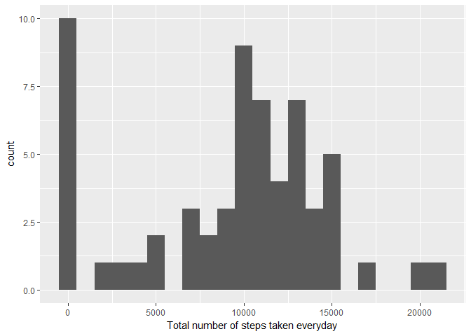
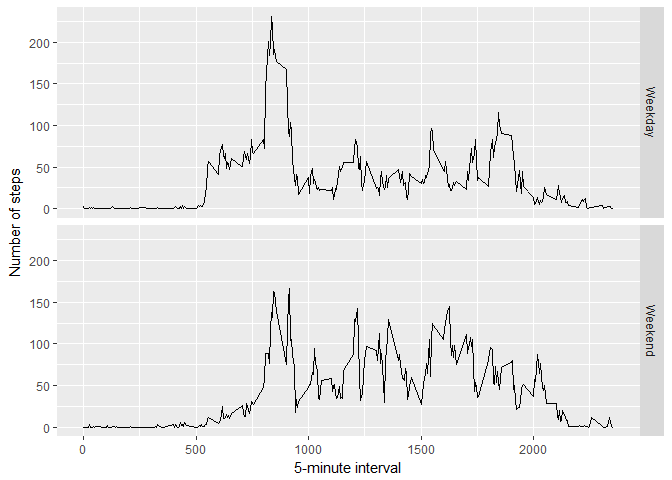

    library(knitr)
    library(markdown)
    library(ggplot2)

The code below reads the given csv file

    data<-read.csv("activity.csv")

Calculating Mean total number of steps taken everyday

    x <- tapply(data$steps, data$date, FUN=sum, na.rm=TRUE)
    qplot(x, binwidth=1000, xlab="Total number of steps taken everyday")

    mean(x, na.rm=TRUE)

    ## [1] 9354.23

    median(x, na.rm=TRUE)

    ## [1] 10395

Trend of average daily activities

    avgs <- aggregate(x=list(steps=data$steps), by=list(interval=data$interval),FUN=mean, na.rm=TRUE)
    ggplot(data=avgs, aes(x=interval, y=steps)) +  geom_line() + xlab("5-minute interval") + ylab("average number of steps taken")

    avgs[which.max(avgs$steps),]

    ##     interval    steps
    ## 104      835 206.1698

Inputing missing values

    mis <- is.na(data$steps)
    table(mis)

    ## mis
    ## FALSE  TRUE 
    ## 15264  2304

Replacing missing vals

    fill.value <- function(steps, interval) {
      filled <- NA
      if (!is.na(steps))
        filled <- c(steps)
      else
        filled <- (avgs[avgs$interval==interval, "steps"])
      return(filled)
    }
    filled.data <- data
    filled.data$steps <- mapply(fill.value, filled.data$steps, filled.data$interval)

Differences in activities - weekday/weekend

    weekday.or.weekend <- function(date) {
      day <- weekdays(date)
      if (day %in% c("Monday", "Tuesday", "Wednesday", "Thursday", "Friday"))
        return("Weekday")
      else if (day %in% c("Saturday", "Sunday"))
        return("Weekend")
      else
        stop("Invalid Date")
    }
    filled.data$date <- as.Date(filled.data$date)
    filled.data$day <- sapply(filled.data$date, FUN=weekday.or.weekend)

average steps

    avgs <- aggregate(steps ~ interval + day, data=filled.data, mean)
    ggplot(avgs, aes(interval, steps)) + geom_line() + facet_grid(day ~ .) + xlab("5-minute interval") + ylab("Number of steps")

